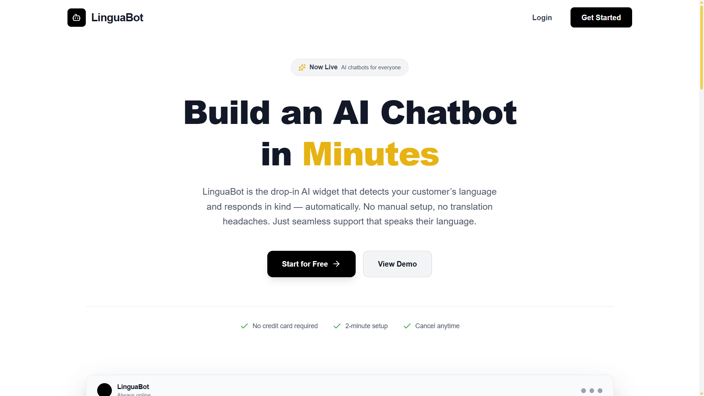
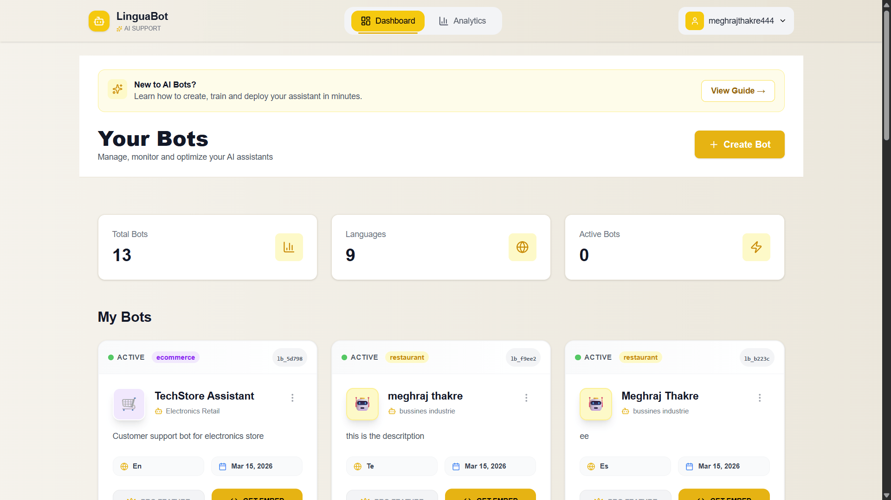
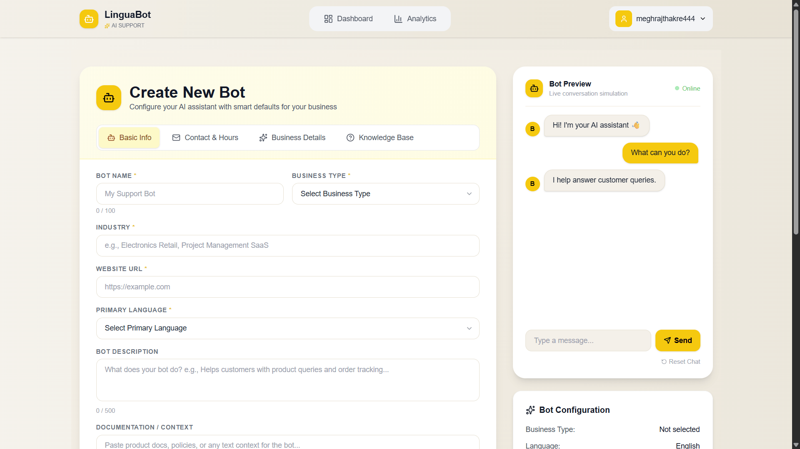
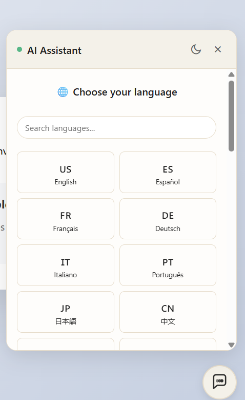
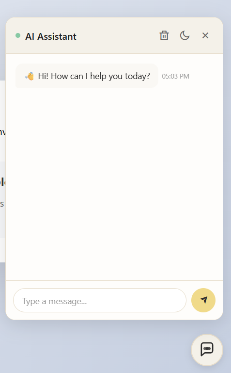

# 🤖 LinguaBot — AI Customer Support Assistant with Real-Time Multilingual Conversations

> Auto-localized customer support powered by  Lingo.dev + gemini. One line of code, instant multilingual support in 50+ languages.

product Link -  https://linguabot.digital/
youtube Demo Link - https://www.youtube.com/watch?v=WkF0NOClIyY


---

## 🚨 The Problem

Modern businesses struggle to provide effective customer support across multiple languages:

- **High operational costs** – Hiring and managing multilingual support teams is expensive and difficult to scale.
- **Language barriers** – Traditional chatbots often fail to understand non-English queries, forcing users to communicate in unfamiliar languages.
- **Poor user experience** – Translation tools often produce inaccurate or context-less responses that reduce customer satisfaction.
- **Limited scalability** – Expanding support to new regions requires additional resources and infrastructure.

## 💡 The Solution

**LinguaBot** is an AI-powered multilingual customer support widget designed to remove language barriers instantly.

- **One-line integration** – Add a simple embed script and enable multilingual support on any website.
- **Automatic language detection** – Powered by Lingo.dev to detect and respond in the visitor's preferred language automatically.
- **AI-driven responses** – Claude Sonnet 4.5 generates intelligent, context-aware answers based on your business knowledge base.
- **Train once, support globally** – Upload your content in one language and automatically serve customers in 50+ languages.
- **Seamless customer experience** – Natural conversations without manual language switching.


 ## ❤️ Why I Built This

Businesses lose customers daily due to language barriers.

LinguaBot was built to make customer support truly global.

Instead of hiring expensive multilingual teams,
businesses can now support every language instantly.

Mission:
Make every website multilingual by default.

---


## 📸 Product Preview
### LandingPage


### Dashboard


### Create bot


### ChooseLanguage


### chat



## ✨ Key Features

* 🌐 **Auto Language Detection** – Detects user language via Lingo.dev
* 🤖 **AI Customer Support** – Powered by Claude Sonnet 4.5
* 🔄 **Real-time Translation** – Responses translated instantly to user’s language
* 📚 **Trainable Knowledge Base** – Upload FAQs, docs, pricing info
* 📊 **Analytics Dashboard** – Track conversations, languages, sentiment
* ⚡ **One-line Installation** – `<script>` tag embed
* 🔐 **Secure** – API keys stored server-side, no client-side exposure

---

                 
## 📁 Project Structure

The repository is organised as a **monorepo** containing three main applications: the React dashboard, the Node.js backend, and the vanilla JavaScript widget.

```
linguabot/
├── frontend/ # React Dashboard (Vite + Tailwind)
│ ├── src/
│ │ ├── pages/
│ │ │ ├── Dashboard.jsx # Main bot list & management
│ │ │ ├── BotEditor.jsx # Bot training & configuration
│ │ │ ├── Analytics.jsx # Conversation analytics & charts
│ │ │ ├── Login.jsx # Authentication page
│ │ │ └── Signup.jsx # New user registration
│ │ ├── components/
│ │ │ ├── BotCard.jsx # Preview card for each bot
│ │ │ ├── TrainingPanel.jsx # FAQ/document upload UI
│ │ │ ├── EmbedCodeModal.jsx # Displays the install snippet
│ │ │ └── ChatPreview.jsx # Live preview of the widget
│ │ ├── services/
│ │ │ └── api.js # Axios client for backend calls
│ │ ├── App.jsx
│ │ └── main.jsx
│ ├── package.json
│ └── README.md
│
├── backend/ # Node.js + Express API
│ ├── routes/
│ │ ├── auth.routes.js # POST /api/auth/signup, /login
│ │ ├── bots.routes.js # CRUD for bot configurations
│ │ ├── chat.routes.js # POST /api/chat (main endpoint)
│ │ └── analytics.routes.js # GET /api/analytics/:botId
│ ├── models/
│ │ ├── User.model.js # MongoDB user schema (email, hash)
│ │ ├── Bot.model.js # Bot config + embedded knowledge base
│ │ └── Conversation.model.js # Chat history & metadata
│ ├── services/
│ │ ├── gemini.service.js # gemini SDK wrapper
│ │ ├── lingo.service.js # Lingo.dev SDK wrapper (detect + translate)
│ │ └── auth.service.js # JWT generation & verification
│ ├── middleware/
│ │ ├── auth.middleware.js # Protect routes with JWT
│ │ └── rateLimiter.middleware.js # Prevent API abuse
│ ├── server.js
│ ├── package.json
│ └── README.md
│
├── widget/ # Embeddable Chat Widget (Vanilla JS)
│ ├── src/
│ │ ├── widget.js # Entry point – initialises chat
│ │ ├── ui.js # Renders the chat UI dynamically
│ │ └── api.js # Calls backend /api/chat endpoint
│ ├── dist/
│ │ └── widget.min.js # Bundled & minified for CDN
│ ├── package.json
│ └── README.md
│
│
├── .env.example
├── .gitignore
└── README.md # This file
```

---


## 🏗️ Architecture

                            ┌─────────────────────────────────────────────────────────────────┐
                            │                        LinguaBot System                         │
                            └─────────────────────────────────────────────────────────────────┘
                            
                                ┌──────────────┐      ┌──────────────┐      ┌──────────────┐
                                │   Dashboard  │      │    Widget    │      │   Backend    │
                                │   (React)    │◄────►│  (Vanilla)   │◄────►│  (Node.js)   │
                                │              │      │              │      │              │
                                │ • Create bots│      │ • Chat UI    │      │ • Claude API │
                                │ • Train AI   │      │ • Embed code │      │ • Lingo.dev  │
                                │ • Analytics  │      │ • Real-time  │      │ • Auth       │
                                └──────────────┘      └──────────────┘      └──────────────┘
                                       │                                            │
                                       └────────────────┬───────────────────────────┘
                                                        │
                                                 ┌──────▼──────┐
                                                 │   MongoDB   │
                                                 │             │
                                                 │ • Bots      │
                                                 │ • Messages  │
                                                 │ • Analytics │
                                                 └─────────────┘


## 🛠️ Tech Stack

| Layer            | Technology                                                       |
| ---------------- | ---------------------------------------------------------------- |
| **Frontend**     | React 18, Vite, Tailwind CSS, React Router, Recharts (analytics) |
| **Backend**      | Node.js, Express, MongoDB (Mongoose), JWT, bcrypt                |
| **Widget**       | Vanilla JavaScript, bundled with Webpack                         |
| **AI**           | Gemini and Grok 
| **Localization** | **Lingo.dev SDK** – language detection + real-time translation   |
| **Hosting**      | Vercel (frontend), Render/Railway (backend), MongoDB Atlas       |

---

## ⚙️ How LinguaBot Works

1 User sends message (any language)

2 Lingo.dev detects language

3 Message translated to English

4 Gemini generates response

5 Response translated back

6 Widget displays localized reply

Result → Seamless multilingual conversation

## 🚀 Getting Started

### Prerequisites

* Node.js 18+
* MongoDB (local or Atlas)
* gemini API Key
* grok API Key
* Lingo.dev API Key

### 1. Clone & Install

```bash
git clone https://github.com/YOUR_USERNAME/linguabot
cd linguabot

# Install backend dependencies
cd backend
npm install

# Install frontend dependencies
cd ../frontend
npm install

# Install widget dependencies
cd ../widget
npm install
```

### 2. Configure Environment

```bash
# In backend/.env
cp .env.example .env
```

Backend .env:

```
PORT=4000
MONGODB_URI=mongodb://localhost:27017/linguabot
JWT_SECRET=your_jwt_secret_here
ANTHROPIC_API_KEY=sk-ant-xxx
LINGODOTDEV_API_KEY=your_lingo_key_here
FRONTEND_URL=http://localhost:5173
WIDGET_ALLOWED_ORIGINS=*
```

Frontend .env:

```
VITE_API_URL=http://localhost:5000
```

### 3. Start Development Servers

```bash
# Terminal 1: Backend
cd backend
npm run dev

# Terminal 2: Frontend
cd frontend
npm run dev

# Terminal 3: Widget (if making changes)
cd widget
npm run dev
```

### 4. Access the App

Dashboard: https://linguabot.digital/dashboard

---

## 🎯 How to Use LinguaBot

### For Business Owners

**Step 1: Sign Up**
Go to dashboard → Create account

**Step 2: Create a Bot**
Click "Create New Bot" and give it a name

**Step 3: Train Your Bot**
Paste your FAQs, product info, pricing.

**Step 4: 
Copy the code and paste into your VS-code
Install on Website**


```html
<script>
  window.LinguaBotConfig = {
    publicKey: "lb_5d798ab2c56b35f337abaf8c3a043ec127135e0904b7804b"
  };
</script>
<script src="https://linguabot-hackathon.onrender.com/widget.js"></script>
```

**Step 5: It Just Works!**

Visitors can now chat in any language.

### For Developers Embedding the Widget

```html
<!DOCTYPE html>
<html>
<head>
<title>My Website</title>
</head>

<body>

<h1>Welcome to my site</h1>

<script>
  window.LinguaBotConfig = {
    publicKey: "lb_5d798ab2c56b35f337abaf8c3a043ec127135e0904b7804b"
  };
</script>
<script src="https://linguabot-hackathon.onrender.com/widget.js"></script>

</body>
</html>
```

---

## 🌐 Lingo.dev Integration Flow

```javascript
import dotenv from "dotenv";
dotenv.config();

const API_KEY = process.env.LINGODOTDEV_API_KEY;
const ENGINE_ID = process.env.LINGODOTDEV_ENGINE_ID; // optional, can be set in env
const API_URL = "https://api.lingo.dev/process/localize";

/**
 * Translates text between languages using Lingo.dev API.
 * Falls back to original text if translation fails or not needed.
 * 
 * @param {string} text - Text to translate
 * @param {string} source - Source locale (e.g., "en")
 * @param {string} target - Target locale (e.g., "hi")
 * @returns {Promise<string>} Translated text
 */
export const translateText = async (text, source = "en", target) => {
  // If no translation needed, return original
  if (!text || source === target) return text;

  try {
    // Wrap the text in an object (API expects key-value pairs)
    const payload = {
      engineId: ENGINE_ID,
      sourceLocale: source,
      targetLocale: target,
      data: { content: text } // Use a meaningful key
    };

    const response = await fetch(API_URL, {
      method: "POST",
      headers: {
        "X-API-Key": API_KEY,
        "Content-Type": "application/json",
      },
      body: JSON.stringify(payload),
    });

    if (!response.ok) {
      const errorText = await response.text();
      throw new Error(`Lingo.dev API error (${response.status}): ${errorText}`);
    }

    const result = await response.json();
    
    // Extract the translated text using the same key
    const translated = result?.data?.content;
    
    if (!translated) {
      console.warn("Translation response missing expected data:", result);
      return text; // fallback
    }

    return translated;
  } catch (error) {
    console.error(" Translation error:", error.message);
    return text; // fallback to original
  }
};
```

---


---

## 🎨 Customization

* Bot name & greeting
* Auto-open
* Operating hours

---

## 🔐 Security

* API keys server-side only
* JWT authentication
* Rate limiting
* CORS protection
* XSS protection
* MongoDB injection protection


---

## 🚢 Deployment

Backend:

```bash
npm run build
npm start
```

Frontend:

```bash
npm run build
```

Widget:

```bash
npm run build
```

---

## 🤝 Contributing

Built for Lingo.dev Hackathon #9 (February 2026). Contributions welcome.

---

## 📄 License

MIT License — Built with ❤️ using  + Lingo.dev

---

## 🔗 Links

Live Demo: https://linguabot.app

Documentation: [docs/API_REFERENCE.md](https://linguabot.digital/how-to-make-bot)

Lingo.dev: https://lingo.dev

## 👨‍💻 Author

Meghraj Thakre

Full Stack Developer

GitHub:
https://github.com/meghrajthakre


Built for Lingo.dev Hackathon #9 — February 2026
